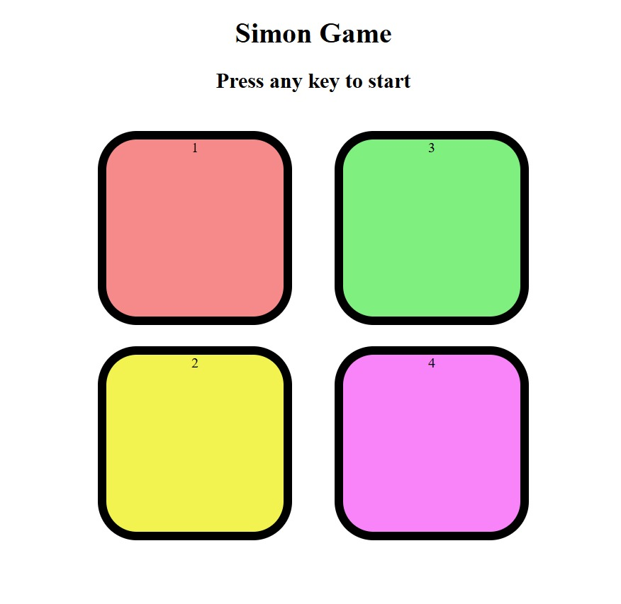

#  Simon Game Clone

A fun and interactive memory game built using HTML, CSS, and JavaScript. This is a simple clone of the classic **Simon Says** game where you follow the pattern and try to reach the highest level you can!

---

##  How to Play

- Press any key to start the game.
- Follow the color pattern shown.
- Click the buttons in the same order as the sequence.
- Each level adds a new color to the sequence.
- The game ends when you click the wrong button.

---

##  Screenshot

---

##  Technologies Used

- **HTML**
- **CSS**
- **JavaScript**

---

##  Features

- Interactive UI with colorful buttons.
- Sound/Visual feedback on clicks.
- Score tracking with increasing difficulty.
- Game Over detection with visual alert.

---

##  Author

Made with ❤️ by Riddhi

---

